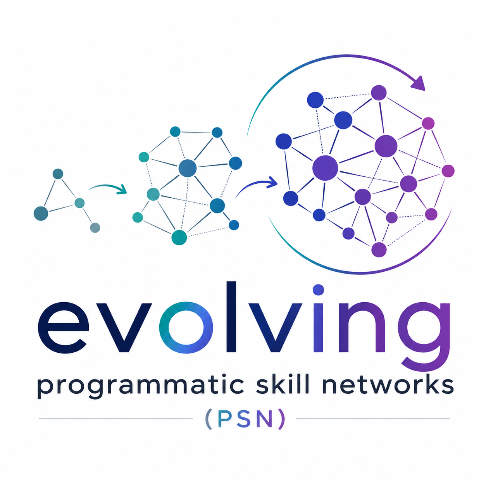

<p align="center">
  
</p>

<h1 align="center">Evolving Programmatic Skill Networks (PSN)</h1>

<p align="center"><b>Lifelong-learning LLM agents with composable, executable skills.</b></p>

- 📄 Paper: [**Evolving Programmatic Skill Networks**](https://arxiv.org/abs/2601.03509) (arXiv:2601.03509, 2026)
- 🤗 #2 Paper of the Day on [Hugging Face Daily Papers](https://huggingface.co/papers/2601.03509)
- 🌐 Project page: <https://evolving-skill-networks.github.io/>
- 🤖 For coding agents (Cursor / Claude Code / Codex / Aider): see [AGENTS.md](AGENTS.md)

## What is PSN?

PSN is an embodied lifelong-learning agent for Minecraft (and other domains via a pluggable abstraction layer). The agent learns a directed graph of reusable, composable **skills** — each represented as executable code with typed parameters, preconditions, and expected effects:

```
s = (C_s, P_s, E_s, Children(s))
   ├─ C_s  = executable code
   ├─ P_s  = parameters (types + semantics)
   ├─ E_s  = preconditions + expected effects
   └─ Children(s) = child skill dependencies
```

Skills improve through iterative LLM-driven reflection and code transformation — no fine-tuning of the base LLM is required. New skills are synthesized from successful executions; failing skills are refactored or decomposed.

## Repository layout

```
psn/
├── skillnet/                  # core Python package — the agent
│   ├── psn.py                 # PSNAgent facade (main learning loop)
│   ├── _psn_impl/             # agent mixins
│   ├── core/                  # domain abstraction layer (ABCs)
│   ├── domains/minecraft/     # Minecraft domain implementation
│   │   └── action_space/      # Minecraft action backend
│   │       ├── env/mineflayer/        # Node.js Minecraft bot
│   │       └── control_primitives/    # JS primitives (mineBlock, craftRecipe, …)
│   └── agents/                # skill graph, optimizer, planner, refactor, …
├── installation/              # Minecraft + Fabric mod install guides
└── docs/architecture/         # 8 deep-dive architecture docs
```

See [AGENTS.md](AGENTS.md) for the full package map and key components.

## Quickstart

```bash
# one-time setup
make install                       # pip install -e .  +  npm install
cp .env.example .env               # then fill in your LLM API key (OpenAI or vLLM)

# every run — pick ONE
./skillnet.sh                      # connect to an open-to-LAN Minecraft client
./skillnet.sh --mc-mode=headless   # OR: PSN sets up + runs a headless Fabric server
```

For the LAN path you must first launch a Minecraft client (we recommend the Modrinth launcher) and open the world to LAN — see [Path A](#path-a--minecraft-client-via-modrinth-recommended). For the headless path PSN handles the server lifecycle on its own — see [Path B](#path-b--headless-fabric-server-no-gui-required).

For a minimal starting point in Python, see [`examples/psn_quickstart.py`](examples/psn_quickstart.py) — a self-contained 5-iteration run that builds the agent and calls `learn()`.

## Installation

PSN requires **Python 3.10**, **Node.js ≥ 16**, and a Minecraft Java Edition 1.19.4 instance. The Minecraft side has two supported setups; pick one.

### 1. Python + Node.js dependencies

```bash
git clone https://github.com/evolving-skill-networks/psn.git
cd psn
conda create -n psn python=3.10 && conda activate psn
make install                                      # pip install -e . + npm install + apply mineflayer patches
cp .env.example .env                              # then fill in your LLM API keys
make verify                                       # sanity-check imports / node_modules / patches / .env / java
```

PSN works against the OpenAI API out of the box (set `OPENAI_API_KEY` in `.env`). To self-host the Qwen3-Coder model used in the paper (or any OpenAI-compatible endpoint), see [`installation/vllm_setup.md`](installation/vllm_setup.md) for the verified vLLM serve command and Docker Compose recipe.

### 2. Minecraft — pick ONE of the two paths

#### Path A — Minecraft client via Modrinth (recommended)

Best for development; lets you watch what the bot does in-game. Any Minecraft launcher works; we recommend [Modrinth](https://modrinth.com/app) because it bundles Fabric loader installation.

> **Requires a purchased Minecraft Java Edition + a Microsoft account.** Launching the official client (via Modrinth or any launcher) needs game ownership and Microsoft login — that's Mojang's requirement, not PSN's. The bot itself joins your LAN world in offline mode as `bot` and needs no account; only the client you launch does. If you don't own Minecraft, use **Path B** below.

1. Install the [**Modrinth App**](https://modrinth.com/app) (Linux / macOS / Windows).
2. In Modrinth, create a new instance: Minecraft **1.19.4** + **Fabric Loader**. Modrinth installs both for you.
3. Install the required Fabric mods into that instance. The minimum set is:
   - [**Fabric API**](https://modrinth.com/mod/fabric-api/versions?g=1.19.4&l=fabric) — base API every Fabric mod depends on.
   - [**Multiplayer Server Pause**](https://modrinth.com/mod/multiplayer-server-pause/versions?g=1.19.4&l=fabric) — PSN sends `/pause` commands to freeze server ticks while the LLM thinks; without this mod the world keeps ticking during 5-30s LLM calls and entities/time drift unpredictably.
   - [**iChunUtil**](https://modrinth.com/mod/ichunutil/versions?g=1.19.4&l=fabric) — runtime dependency of Multiplayer Server Pause; Modrinth usually installs it automatically when you add the mod above, but double-check.

   See [`installation/fabric_mods_install.md`](installation/fabric_mods_install.md) for the full list including optional dev mods (Mod Menu, Server Replay).
4. Launch the instance, create a singleplayer world (recommended: Creative or Survival with cheats allowed; flat or normal terrain both work).
5. Once you are in the world, open the pause menu → **Open to LAN** → **Allow Cheats: ON** → **Start LAN World**. Note the port number printed in chat — but you do **not** need to pass it; PSN auto-detects it.
6. Run PSN:
   ```bash
   ./skillnet.sh                  # auto-detects the LAN port
   ```

If PSN fails to detect a server it will tell you to open the world to LAN. If multiple Minecraft clients are listening it will warn and pick the lowest port — pass `--mc-port=PORT` to override.

#### Path B — Headless Fabric server (no GUI required)

Best for remote servers / CI / no display attached. PSN installs and manages the server for you.

> **No Minecraft purchase or account required.** The server runs in offline mode (`online_mode: false`): the free Minecraft server jar is downloaded from Mojang and the bot joins unauthenticated. Use this path if you don't own Minecraft Java Edition.

```bash
./skillnet.sh --mc-mode=headless
```

On first launch this triggers `installation/setup_fabric_server.sh`, which:

- downloads the Fabric installer and the Minecraft 1.19.4 server jar into `installation/fabric_server/` (this directory is gitignored),
- accepts the EULA on your behalf (only because you ran the script — review `installation/fabric_server_config.json` first if you care),
- renders `server.properties` from `installation/fabric_server_config.json` (seed, gamemode, difficulty, port, etc. — edit before running if you want non-defaults).

Subsequent launches reuse the same world and skip setup. The server is stopped automatically when PSN exits.

Manual control if you want it:

```bash
bash installation/setup_fabric_server.sh        # one-time setup
bash installation/run_fabric_server.sh          # foreground start
bash installation/run_fabric_server.sh --stop   # stop a daemonized server
```

### 3. (Optional) Fabric mods inside the Minecraft instance

PSN itself does not require any mods to run, but a few helper mods make development easier (recording bot trajectories, etc.). See [`installation/fabric_mods_install.md`](installation/fabric_mods_install.md) for details.

## Running PSN

### Path A — against an open-to-LAN Minecraft client

1. Launch your Minecraft client (we recommend Modrinth) and enter a singleplayer world (see [Path A installation](#path-a--minecraft-client-via-modrinth-recommended) for the one-time world setup).
2. Open the pause menu → **Open to LAN** → toggle **Allow Cheats** ON → **Start LAN World**.
3. In a separate terminal:
   ```bash
   conda activate psn
   ./skillnet.sh
   ```
   PSN scans local Java listener ports, sends a real Minecraft handshake to find your LAN world, and connects to it. No port flag needed.

If you have multiple Minecraft processes running on the host, PSN warns and picks the lowest port; pass `--mc-port=PORT` to force a specific one.

### Path B — with the managed headless Fabric server

```bash
conda activate psn
./skillnet.sh --mc-mode=headless
```

The script installs the server on first run (downloads Minecraft 1.19.4 + Fabric loader into `installation/fabric_server/`, renders `server.properties` from `installation/fabric_server_config.json`), starts it in the background, runs PSN against it, then stops it on exit. Subsequent runs skip the install step. Edit `installation/fabric_server_config.json` to change the seed, gamemode, difficulty, port, etc.

### What you will see

On a fresh run PSN prints a banner with the active configuration, then starts iterating. Each iteration is one task attempt: the planner proposes a task, the action agent writes code, the bot executes it, and the critic decides whether the task succeeded. Two log markers tell you where you are:

```
[Env Step] Iteration 7                           # one per task-execution iteration
[Lifecycle] on_task_completed: ... success=True  # task verdict
```

Per-iteration progress is written under `<ckpt-dir>/progress/`:

- `iteration_log.jsonl` — one row per recorded iteration with task + success + skills executed
- `resource_stats.jsonl` — cumulative inventory snapshots
- `skill_events.jsonl` — skill versioning events (created, optimized, refactored, deleted)

You can stop PSN at any time with Ctrl-C — checkpoints are saved between iterations. To resume, re-run `./skillnet.sh` and pick the existing checkpoint dir from the interactive prompt (or pass `--ckpt-dir=DIR --resume`).

### Common runtime options

```bash
./skillnet.sh --manual                # you input tasks instead of the curriculum agent
./skillnet.sh --inference             # single-task mode (don't iterate the curriculum)
./skillnet.sh --ckpt-dir=ckpt_run2    # use a specific checkpoint directory
./skillnet.sh --max-iterations=50     # cap iterations (default 3160)
./skillnet.sh --model=openai          # use OpenAI API (default reads .env)
./skillnet.sh --model=vllm            # use vLLM endpoint from .env
./skillnet.sh --help                  # full flag list, including ablation switches
```

For ablation/eval-only flags (`--no-optimizer`, `--no-refactor`, `--pure-reasoning`, `--include-skill-code`, and the optimization-gating parameters) see `./skillnet.sh --help` — they are for reproducing experiments from the paper, not part of the normal workflow.

## For coding agents

If you're a coding agent (Cursor, Claude Code, OpenAI Codex, Aider, Continue, …) helping a user contribute to or extend this codebase, read **[AGENTS.md](AGENTS.md)** first. It contains the package tree with line-level pointers, the exact build commands, code conventions, and the canonical entry points — in the form agents are designed to consume.

## Architecture

For a deeper architectural understanding, see the 8 deep-dive docs under [`docs/architecture/`](docs/architecture/):

- `domain_integration_guide.md` — how to implement a new domain (ABCs, wiring, checklist)
- `di_patterns_handbook.md` — dependency injection patterns
- `mixin_architecture.md` — mixin conventions and MRO rules
- `config_architecture.md` — PSNConfig structure
- `knowledge_retrieval.md` — knowledge index and retrieval
- `skill_graph_evolution.md` — skill DAG versioning
- `planner_strategies.md` — planning strategies
- `optimization_pipeline.md` — two-phase optimization

## Citation

If you find this work useful, please cite:

```bibtex
@article{shi2026psn,
  title   = {Evolving Programmatic Skill Networks},
  author  = {Shi, Haochen and Yuan, Xingdi and Liu, Bang},
  journal = {arXiv preprint arXiv:2601.03509},
  year    = {2026}
}
```

A machine-readable citation is also provided in [`CITATION.cff`](CITATION.cff).

## Acknowledgments

We thank the authors of [Voyager](https://github.com/MineDojo/Voyager) (Wang et al.,
2023, MIT-licensed): PSN's Minecraft interface (control primitives and the mineflayer
bridge) is adapted from their release.

## License

PSN is released under the [MIT License](LICENSE).
