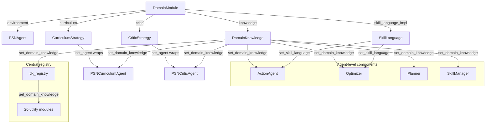

# Domain Integration Guide

## 1. Overview

PSN's core learning algorithms -- skill graph management, two-phase optimization, backward-chaining planning, parameter inference -- are designed to be **domain-agnostic**. The Domain Abstraction Layer decouples these algorithms from Minecraft-specific knowledge (recipes, block properties, Mineflayer API semantics) so that the same PSN framework can drive learning in any environment that provides executable skill code and observable state.

The abstraction is built on four ABCs and one Protocol, all defined in `skillnet/core/`:

| Abstraction | File | Purpose |
|---|---|---|
| `Environment` | `skillnet/core/environment.py` | Game/world interaction (reset, step, close) |
| `DomainKnowledge` | `skillnet/core/domain.py` | The primary knowledge interface (90 methods: 6 abstract + 84 optional) |
| `CurriculumStrategy` | `skillnet/core/curriculum.py` | Task proposal and progress tracking |
| `CriticStrategy` | `skillnet/core/critic.py` | Task success evaluation |
| `SkillLanguage` | `skillnet/core/skill_language.py` | Code parsing, validation, and transformation |

These are bundled into a `DomainModule` dataclass and injected into `PSNAgent` via the `from_domain()` factory method.

---

## 2. Core ABCs

### 2.1 Environment (`skillnet/core/environment.py`)

Gymnasium-style lifecycle for code execution environments.

```python
# skillnet/core/environment.py:19-78
class Environment(ABC):

    @abstractmethod
    def reset(self, *, seed=None, options=None) -> Tuple[Any, Dict[str, Any]]:
        """Reset to initial state. Returns (observation, info)."""

    @abstractmethod
    def step(self, code: str, programs: str = "",
             skill_names: Optional[List[str]] = None) -> Any:
        """Execute code in the environment and return observations."""

    @abstractmethod
    def close(self) -> None:
        """Release all resources."""

    # Optional hooks
    def pause(self) -> bool: ...
    def unpause(self) -> bool: ...
```

Key design decisions:
- `step()` accepts **code strings**, not discrete actions -- the agent generates executable programs
- `programs` carries library code (control primitives + learned skills) to make available during execution
- `pause()`/`unpause()` are optional for environments that support freezing (e.g., pausing Minecraft ticks during LLM calls)

### 2.2 DomainKnowledge (`skillnet/core/domain.py`)

The main ABC. Covered in depth in [Section 3](#3-domainknowledge-deep-dive).

### 2.3 CurriculumStrategy (`skillnet/core/curriculum.py`)

Drives the learning loop by proposing tasks of increasing difficulty.

```python
# skillnet/core/curriculum.py:19-111
class CurriculumStrategy(ABC):

    # Required
    @abstractmethod
    def propose_next_task(self, *, events, chest_observation="",
                          max_retries=5, **kwargs) -> Tuple[Any, str]: ...
    @abstractmethod
    def task_count(self) -> int: ...
    @abstractmethod
    def add_completed_tasks(self, tasks: List[str]) -> None: ...
    @abstractmethod
    def add_failed_tasks(self, tasks: List[str]) -> None: ...

    # Optional (with defaults)
    def set_skill_manager(self, skill_manager) -> None: ...
    def get_completed_tasks(self) -> List[str]: ...
    def get_failed_tasks(self) -> List[str]: ...
    def count_task_failures(self) -> Dict[str, int]: ...
    def remove_matching_failed_tasks(self, predicate: Callable) -> int: ...
    def update_exploration_progress(self, info: Dict[str, Any]) -> None: ...
    def update_task_result(self, task: str, success: bool) -> None: ...
    def decompose_task(self, task: str, events: Any) -> Any: ...
    def reset_task_lists(self) -> None: ...
    @property
    def progress(self) -> int: ...
    def get_task_context(self, task: str) -> str: ...
```

The PSN learning loop calls `propose_next_task()` each iteration, then records the outcome via `add_completed_tasks()` or `add_failed_tasks()`.

### 2.4 CriticStrategy (`skillnet/core/critic.py`)

Evaluates whether a task was completed successfully.

```python
# skillnet/core/critic.py:18-73
class CriticStrategy(ABC):

    @abstractmethod
    def check_task_success(self, *, task, events, context="",
                           chest_observation="", max_retries=5,
                           **kwargs) -> Tuple[bool, str, Dict[str, Any]]:
        """Returns (success, critique, quality_metrics)."""

    @abstractmethod
    def render_human_message(self, *, events, task, context="",
                             chest_observation="", **kwargs) -> Any:
        """Build evaluation message for the LLM critic."""
```

Both methods are abstract with no defaults -- every domain must define its own success criteria.

### 2.5 SkillLanguage Protocol (`skillnet/core/skill_language.py`)

A `@runtime_checkable` Protocol (not an ABC) for language-specific code operations. See [Section 9](#9-skilllanguage-protocol) for the full specification.

---

## 3. DomainKnowledge Deep Dive

`DomainKnowledge` (defined in `skillnet/core/domain.py`) is the largest ABC, with 6 abstract methods and 84 optional methods (90 total) organized into categories. Optional methods return empty/permissive defaults so domains can implement gradually.

### 3.1 Abstract Methods (required)

| Method | Return Type | Purpose |
|---|---|---|
| `get_all_knowledge()` | `List[Any]` | All knowledge items for knowledge index construction |
| `get_knowledge_for_error(error_text, code)` | `List[Any]` | Knowledge items relevant to a specific error |
| `get_control_primitives()` | `List[str]` | Names of control primitive functions available to skills |
| `load_control_primitive_code()` | `List[str]` | Source code strings for all control primitives |
| `get_skill_language()` | `str` | Programming language identifier (e.g., `"javascript"`, `"python"`) |
| `get_system_prompt_template()` | `str` | System prompt template with `{programs}` and `{response_format}` placeholders |

### 3.2 Optional Methods -- Knowledge Retrieval

| Method | Return Type | Default | Purpose |
|---|---|---|---|
| `get_item_categories()` | `Dict[str, Dict[str, Any]]` | `{}` | Item category mapping for effect matching |
| `get_safe_interchange_categories()` | `set` | `set()` | Categories where items are interchangeable |
| `get_type_keywords()` | `Dict[str, list]` | `{}` | Type keywords for skill name normalization |
| `get_known_functions()` | `Dict[str, Set[str]]` | `{}` | Function sets for code validation (bot_methods, primitives, helpers) |

### 3.3 Optional Methods -- Optimizer Knowledge

| Method | Return Type | Default | Purpose |
|---|---|---|---|
| `get_domain_name()` | `str` | `"domain"` | Human-readable name for prompt text |
| `get_environment_rules(error_text)` | `List[str]` | `[]` | Environment rules relevant to an error |
| `get_primitive_knowledge(error_text, code)` | `str` | `""` | Formatted primitive/API knowledge for optimizer analysis |
| `get_environment_context(state)` | `str` | `""` | Environment context from execution pre-state (biome, resources) |
| `get_reasoning_examples(error_text, max_examples)` | `str` | `""` | Formatted reasoning examples for optimizer analysis |
| `get_detailed_knowledge_for_error(error_text, code, chat_log, kr_logger)` | `str` | `""` | LLM-driven knowledge retrieval with full context |
| `get_code_validators()` | `List[Any]` | `[]` | Domain-specific code validators for optimizer pipeline |

### 3.4 Optional Methods -- Prompt Templates

| Method | Return Type | Default | Purpose |
|---|---|---|---|
| `get_prompt(name)` | `str` | `""` | **Primary dispatcher**: loads prompt template by name from domain-owned files (e.g., `domains/minecraft/prompts/{name}.txt`) |
| `get_critic_prompt_template()` | `str` | `""` | System prompt for critic agent (delegates to `get_prompt("critic")`) |
| `get_curriculum_prompt_template()` | `str` | `""` | System prompt for curriculum agent |
| `get_action_response_format()` | `str` | `""` | Response format for action agent |
| `get_reparameterize_prompt_template()` | `str` | `""` | Prompt for reparameterizing single-arg functions |

### 3.5 Optional Methods -- Planner / Inference / Refactor

| Method | Return Type | Default | Purpose |
|---|---|---|---|
| `get_effect_extraction_verbs()` | `Dict[str, List[str]]` | `{}` | Verb patterns for rule-based effect extraction |
| `get_variant_patterns()` | `List[Tuple[str, str]]` | `[]` | `(regex, param_name)` pairs for skill refactoring |
| `get_variant_suffixes()` | `List[str]` | `[]` | Regex patterns identifying variant words in skill names |
| `get_resource_not_found_patterns()` | `dict` | `{}` | Resource-specific error patterns for environmental feedback |
| `get_inference_rules()` | `dict` | `{}` | Domain-specific rules for parameter resolution |
| `get_require_patterns()` | `list` | `[]` | Require/import statement patterns for code generation |
| `get_global_dependencies()` | `dict` | `{}` | Globally-provided dependency declarations (e.g., `mcData`, `Vec3`) |
| `get_primitive_semantics()` | `Dict[str, Dict[str, bool]]` | `{}` | Produce/consume semantics for control primitives |

### 3.6 Optional Methods -- Curriculum / Orchestrator

| Method | Return Type | Default | Purpose |
|---|---|---|---|
| `get_core_inventory_pattern()` | `str` | `""` | Regex for core inventory items |
| `get_task_complexity_tiers()` | `Dict[str, list]` | `{}` | Keyword tiers for dynamic failure limits |
| `get_tool_unlock_mapping()` | `Dict[str, list]` | `{}` | Tool-to-task keyword unlock mapping |
| `get_complex_task_keywords()` | `list` | `[]` | Keywords triggering task decomposition |
| `get_simple_task_patterns()` | `list` | `[]` | Regex patterns identifying non-decomposable tasks |
| `get_resource_thresholds()` | `dict` | `{}` | Default resource tracking thresholds |
| `get_reset_commands()` | `List[str]` | `[]` | Chat commands to run after environment reset |
| `get_task_skill_mapping()` | `Dict[str, list]` | `{}` | Task description to skill name mappings |
| `get_crafting_chain_config()` | `dict` | `{}` | Crafting chain configuration for parameter inference |
| `check_tool_efficiency(task, inventory)` | `Optional[str]` | `None` | Check if current tools are efficient for a task |
| `get_revert_failed_action_code(blocks, positions)` | `Optional[str]` | `None` | Code to revert side effects of failed actions |

### 3.7 Optional Methods -- Item Knowledge

| Method | Return Type | Default | Purpose |
|---|---|---|---|
| `get_item_groups()` | `Dict[str, List[str]]` | `{}` | Item substitution groups |
| `get_item_to_group_mapping()` | `Dict[str, str]` | `{}` | Reverse mapping from items to groups |
| `get_resource_aliases()` | `Dict[str, List[str]]` | `{}` | Resource name aliases for effect matching |
| `get_item_name_categories()` | `Dict[str, List[str]]` | `{}` | Item name categories for validation |
| `get_common_items()` | `Set[str]` | `set()` | All known valid items |
| `get_common_blocks()` | `Set[str]` | `set()` | All known valid blocks |
| `is_valid_item(item_name)` | `bool` | `True` (permissive) | Check if item is known valid |
| `is_valid_block(block_name)` | `bool` | `True` (permissive) | Check if block is known valid |
| `is_armor_item(item_name)` | `bool` | `False` | Check if item is armor |
| `get_armor_tier(item_name)` | `int` | `-1` | Armor tier level |
| `get_armor_slot(item_name)` | `Optional[str]` | `None` | Equipment slot for armor |
| `get_tool_tier_config()` | `dict` | `{}` | Tool tier configuration |

### 3.8 Optional Methods -- Responsibility Validation

| Method | Return Type | Default | Purpose |
|---|---|---|---|
| `get_symbolic_knowledge_base()` | `Any` | `None` | Symbolic KB for recipe/dependency queries |
| `get_resource_matcher()` | `Any` | `None` | Resource consistency checker |
| `get_responsibility_validation_patterns()` | `Dict[str, list]` | `{}` | Keyword-based responsibility validation patterns |
| `get_severe_responsibility_violation_keywords()` | `set` | `set()` | Keywords triggering immediate rejection |
| `get_responsibility_prompt_context()` | `str` | `""` | Domain-specific context for LLM responsibility prompt |

---

## 4. DomainModule Container

`DomainModule` (`skillnet/core/domain.py:663-678`) bundles all domain components into a single dataclass passed to `PSNAgent.from_domain()`.

```python
# skillnet/core/domain.py:663-678
@dataclass
class DomainModule:
    environment: Environment           # Game/world interaction backend
    knowledge: DomainKnowledge         # Domain knowledge provider
    curriculum: CurriculumStrategy     # Task proposal strategy
    critic: CriticStrategy             # Success evaluation strategy
    name: str = "unknown"              # Human-readable domain name
    skill_language: str = "javascript" # Language identifier string
    skill_language_impl: Optional["SkillLanguage"] = None  # Language implementation
```

| Field | Type | Required | Purpose |
|---|---|---|---|
| `environment` | `Environment` | Yes | Execution backend |
| `knowledge` | `DomainKnowledge` | Yes | Knowledge and configuration provider |
| `curriculum` | `CurriculumStrategy` | Yes | Task generation |
| `critic` | `CriticStrategy` | Yes | Success evaluation |
| `name` | `str` | No (default `"unknown"`) | Domain identifier for logging/display |
| `skill_language` | `str` | No (default `"javascript"`) | Language name string |
| `skill_language_impl` | `SkillLanguage` | No (default `None`) | Language implementation for code operations |

---

## 5. Domain Registry

There are two distinct registries in the system:

- **Domain Registry** (`skillnet/domains/__init__.py`): Factory registry for creating `DomainModule` instances by name (e.g., `get_domain("minecraft")`).
- **DK Registry** (`skillnet/core/dk_registry.py`): Runtime singleton holding the current `DomainKnowledge` instance, set by `from_domain()`. Utility modules call `get_domain_knowledge()` from this registry instead of maintaining their own module-level globals.

The domain registry provides a simple factory pattern for domain discovery and instantiation.

```python
# skillnet/domains/__init__.py:19-46
_DOMAIN_REGISTRY: Dict[str, Callable[..., "DomainModule"]] = {}

def register_domain(name: str, factory: Callable[..., "DomainModule"]):
    """Register a domain factory function."""
    _DOMAIN_REGISTRY[name.lower()] = factory

def get_domain(name: str, **kwargs) -> "DomainModule":
    """Create a DomainModule by registered name."""
    key = name.lower()
    if key not in _DOMAIN_REGISTRY:
        available = list(_DOMAIN_REGISTRY.keys())
        raise KeyError(f"Unknown domain: '{name}'. Available: {available}")
    return _DOMAIN_REGISTRY[key](**kwargs)

def list_domains() -> list:
    """Return names of all registered domains."""
    return list(_DOMAIN_REGISTRY.keys())
```

Built-in domains are auto-registered on import:

```python
# skillnet/domains/__init__.py:42-46
try:
    from skillnet.domains.minecraft import MinecraftDomain
    register_domain("minecraft", MinecraftDomain)
except ImportError:
    pass
```

These are also re-exported from `skillnet/core/__init__.py` for convenience:

```python
from skillnet.domains import register_domain, get_domain, list_domains
```

Usage:

```python
# Explicit construction
from skillnet.domains.minecraft import MinecraftDomain
domain = MinecraftDomain(mc_port=25565)

# Registry-based construction
from skillnet.core import get_domain
domain = get_domain("minecraft", mc_port=25565)

# Shortest path (combines registry + from_domain)
agent = PSNAgent.from_registered_domain("minecraft", mc_port=25565)
```

---

## 6. Wiring: PSNAgent.from_domain()

The `from_domain()` class method (`skillnet/psn.py:406-544`) is the primary integration point. It takes a `DomainModule` and a `PSNConfig`, constructs the agent, then injects domain knowledge into every sub-module that needs it.

### 6.1 Step-by-Step Injection

1. **Store domain reference**: `instance._domain = domain`
2. **Wire DomainKnowledge into agent-level components** (via `set_domain_knowledge()`):
   - `action_agent` (ParameterizedActionAgent)
   - `optimizer` (SkillGraphOptimizer)
   - `planner` (GraphPlanner)
   - `skill_manager` (SkillGraphManager)
3. **Wire DomainKnowledge into central registry** (single call to `dk_registry.set_domain_knowledge()`):
   - All 20 utility modules read from `dk_registry.get_domain_knowledge()` instead of individual setters
4. **Wire SkillLanguage implementation**:
   - `instance._skill_language = lang_impl`
   - `action_agent.set_skill_language(lang_impl)`
   - `optimizer.set_skill_language(lang_impl)`
5. **Override config**: If `knowledge.get_core_inventory_pattern()` returns a non-empty pattern, override `config.curriculum.core_inventory_items`
6. **Wire CurriculumStrategy**: Wrap existing `curriculum_agent` via `set_agent()`
7. **Wire CriticStrategy**: Wrap existing `critic_agent` via `set_agent()`
8. **Propagate knowledge to critic/curriculum**: Call `set_domain_knowledge()` on the unwrapped agent instances

### 6.2 Injection Flow Diagram



### 6.3 Alternative Entry Points

```python
# 1. from_domain() -- explicit DomainModule
domain = MinecraftDomain(mc_port=25565)
agent = PSNAgent.from_domain(domain, PSNConfig())

# 2. from_registered_domain() -- registry lookup + from_domain()
agent = PSNAgent.from_registered_domain("minecraft", mc_port=25565)

# 3. from_components() -- pre-built components (for testing)
agent = PSNAgent.from_components(action_agent=..., optimizer=..., config=PSNConfig())
```

---

## 7. Reference Implementation: MinecraftDomain

### 7.1 Factory Function

The `MinecraftDomain()` factory (`skillnet/domains/minecraft/__init__.py:22-79`) constructs all four domain components and bundles them:

```python
# skillnet/domains/minecraft/__init__.py:22-79
def MinecraftDomain(*, mc_port=None,
                    server_host="http://127.0.0.1", server_port=3000,
                    request_timeout=900, log_path="./logs",
                    model_name="gpt-5-mini", llm=None,
                    curriculum_agent=None, critic_agent=None,
                    kr_llm=None) -> DomainModule:

    env = MinecraftEnv(mc_port=mc_port, ...)
    knowledge = MinecraftKnowledge(model_name=model_name, kr_llm=kr_llm)
    curriculum = MinecraftCurriculum(agent=curriculum_agent)
    critic = MinecraftCritic(agent=critic_agent)

    return DomainModule(
        environment=env,
        knowledge=knowledge,
        curriculum=curriculum,
        critic=critic,
        name="minecraft",
        skill_language="javascript",
        skill_language_impl=JavaScriptLanguage(),
    )
```

### 7.2 MinecraftKnowledge

`MinecraftKnowledge` (`skillnet/domains/minecraft/knowledge/__init__.py:14-654`) implements all 6 abstract methods and most optional methods. Key implementation patterns:

**Lazy imports**: All heavy modules are imported inside method bodies to avoid circular imports and reduce startup time.

```python
# Example: skillnet/domains/minecraft/knowledge/__init__.py:41-45
def get_all_knowledge(self) -> List[Any]:
    from skillnet.domains.minecraft.knowledge.game import get_all_game_knowledge
    from skillnet.domains.minecraft.knowledge.api import get_all_api_knowledge
    from skillnet.domains.minecraft.knowledge.primitives import get_all_primitive_knowledge
    return get_all_game_knowledge() + get_all_api_knowledge() + get_all_primitive_knowledge()
```

**Knowledge builder registration**: On `__init__`, registers Minecraft-specific knowledge builders via dependency injection into the domain-agnostic `KnowledgeIndex`:

```python
# skillnet/domains/minecraft/knowledge/__init__.py:27-33
def _register_knowledge_builder(self):
    from skillnet.agents.optimizer.knowledge.index import register_knowledge_builder
    from skillnet.domains.minecraft.knowledge.index_builder import (
        build_minecraft_knowledge_entries,
    )
    register_knowledge_builder(build_minecraft_knowledge_entries)
```

**Prompt loading**: `get_prompt(name)` is the primary dispatcher, loading templates from
`skillnet/domains/minecraft/prompts/{name}.txt`. Specific prompt methods delegate to it:

```python
# skillnet/domains/minecraft/knowledge/__init__.py
def get_prompt(self, name: str) -> str:
    """Load prompt template by name from domain-owned prompt files."""
    prompt_dir = Path(__file__).parent.parent / "prompts"
    path = prompt_dir / f"{name}.txt"
    if path.exists():
        return path.read_text()
    return ""

def get_system_prompt_template(self) -> str:
    return self.get_prompt("parameterized_action_template")
```

**LLM-driven knowledge retrieval**: `get_detailed_knowledge_for_error()` delegates to the domain-agnostic `retrieve_knowledge_for_analysis()` function, injecting Minecraft-specific query prompts and fallback queries:

```python
# skillnet/domains/minecraft/knowledge/__init__.py:187-206
def get_detailed_knowledge_for_error(self, error_text, code="", chat_log="",
                                      kr_logger=None) -> str:
    from skillnet.agents.optimizer.knowledge.llm_knowledge_retriever import (
        retrieve_knowledge_for_analysis,
    )
    from skillnet.domains.minecraft.kr_config import (
        MINECRAFT_QUERY_PROMPT, minecraft_fallback_queries,
    )
    return retrieve_knowledge_for_analysis(
        feedback_content=error_text, chat_log=chat_log, skill_code=code,
        llm=self._kr_llm, kr_logger=kr_logger,
        query_prompt=MINECRAFT_QUERY_PROMPT,
        fallback_queries_fn=minecraft_fallback_queries,
    )
```

### 7.3 MinecraftEnv

`MinecraftEnv` (`skillnet/domains/minecraft/environment.py:13-95`) wraps `SkillNetEnv` with lazy initialization. The underlying environment is not created until the first `reset()` call:

```python
# skillnet/domains/minecraft/environment.py:51-56
def _ensure_env(self):
    if self._env is None:
        from skillnet.env.bridge import SkillNetEnv
        self._env = SkillNetEnv(**self._init_kwargs)
    return self._env
```

### 7.4 MinecraftCurriculum and MinecraftCritic

Both are thin wrappers that delegate to the existing `PSNCurriculumAgent` and `PSNCriticAgent` instances. They implement the ABC interface and forward calls to the underlying agent, which is set via `set_agent()` during `from_domain()` wiring.

```
MinecraftCurriculum  -->  wraps  -->  PSNCurriculumAgent
MinecraftCritic      -->  wraps  -->  PSNCriticAgent
```

### 7.5 Knowledge Data Organization

Minecraft knowledge data lives under `skillnet/domains/minecraft/knowledge/`:

```
skillnet/domains/minecraft/knowledge/
├── __init__.py              # MinecraftKnowledge class
├── game/                    # Game rules: blocks, mechanics, ores, resources
├── api/                     # Mineflayer API: bot_methods, pathfinder, inventory
├── primitives/              # Control primitives: mining, crafting, smelting, ...
├── index_builder.py         # KnowledgeIndex entry builder
├── api_behaviors.py         # API behavior knowledge for error diagnosis
├── minecraft_env.py         # Environment rule definitions
├── reasoning_examples.py    # Curated reasoning examples for optimizer
├── knowledge_base.py        # MinecraftKnowledgeBase (symbolic KB)
├── resource_matcher.py      # MinecraftResourceMatcher
├── function_sets.py         # Bot methods, primitive names, helper patterns
├── item_categories.py       # Item category definitions
├── minecraft_rules.py       # Inference rules (wood types, ore types)
└── kr_config.py             # LLM knowledge retrieval config (query prompt, fallbacks)
```

---

## 8. Implementing a New Domain

### 8.1 Checklist

1. **Create directory**: `skillnet/domains/<your_domain>/`
2. **Implement `DomainKnowledge`** subclass with all 6 abstract methods
3. **Implement `Environment`** subclass
4. **Implement `CurriculumStrategy`** subclass (or wrap an existing agent)
5. **Implement `CriticStrategy`** subclass (or wrap an existing agent)
6. **Choose a `SkillLanguage`** implementation (`JavaScriptLanguage` or `PythonLanguage`, or implement a new one)
7. **Create a factory function** returning `DomainModule`
8. **Register the domain** in `skillnet/domains/__init__.py`
9. **Implement optional methods** as needed (start with empty defaults, add as required)

### 8.2 Step-by-Step

#### Step 1: Create the package

```
skillnet/domains/my_domain/
├── __init__.py         # Factory function + DomainModule assembly
├── knowledge.py        # DomainKnowledge subclass
├── environment.py      # Environment subclass
├── curriculum.py       # CurriculumStrategy subclass
└── critic.py           # CriticStrategy subclass
```

#### Step 2: Implement DomainKnowledge (minimum viable)

```python
# skillnet/domains/my_domain/knowledge.py
from typing import Any, Dict, List
from skillnet.core.domain import DomainKnowledge

class MyDomainKnowledge(DomainKnowledge):

    def get_all_knowledge(self) -> List[Any]:
        return ["My domain fact 1", "My domain fact 2"]

    def get_knowledge_for_error(self, error_text: str, code: str = "") -> List[Any]:
        return []  # Start empty, add error-specific knowledge as you learn

    def get_control_primitives(self) -> List[str]:
        return ["click", "navigate", "submit"]  # Your primitive function names

    def load_control_primitive_code(self) -> List[str]:
        # Return source code of your primitives
        return [open("path/to/primitive.py").read()]

    def get_skill_language(self) -> str:
        return "python"

    def get_system_prompt_template(self) -> str:
        return """You are a skilled programmer writing {skill_language} code.
Available functions:
{programs}

{response_format}"""
```

#### Step 3: Implement Environment

```python
# skillnet/domains/my_domain/environment.py
from skillnet.core.environment import Environment

class MyDomainEnv(Environment):

    def reset(self, *, seed=None, options=None):
        # Reset your environment
        return observation, info_dict

    def step(self, code, programs="", skill_names=None):
        # Execute `code` in your environment
        # Return observation with execution results
        return observation

    def close(self):
        # Clean up resources
        pass
```

#### Step 4: Implement CurriculumStrategy

```python
# skillnet/domains/my_domain/curriculum.py
from skillnet.core.curriculum import CurriculumStrategy

class MyDomainCurriculum(CurriculumStrategy):

    def __init__(self):
        self._completed = []
        self._failed = []

    def propose_next_task(self, *, events, **kwargs):
        # Return (task, context_string)
        return "my next task", "context for the task"

    def task_count(self):
        return len(self._completed)

    def add_completed_tasks(self, tasks):
        self._completed.extend(tasks)

    def add_failed_tasks(self, tasks):
        self._failed.extend(tasks)
```

#### Step 5: Implement CriticStrategy

```python
# skillnet/domains/my_domain/critic.py
from skillnet.core.critic import CriticStrategy

class MyDomainCritic(CriticStrategy):

    def check_task_success(self, *, task, events, **kwargs):
        # Evaluate success
        success = ...
        critique = "Explanation of result"
        metrics = {"quality": 0.8}
        return success, critique, metrics

    def render_human_message(self, *, events, task, **kwargs):
        # Build LLM evaluation message
        return {"role": "user", "content": f"Did the agent complete: {task}?"}
```

#### Step 6: Create factory and register

```python
# skillnet/domains/my_domain/__init__.py
from skillnet.core.domain import DomainModule
from skillnet.languages.python import PythonLanguage
from .knowledge import MyDomainKnowledge
from .environment import MyDomainEnv
from .curriculum import MyDomainCurriculum
from .critic import MyDomainCritic

def MyDomain(**kwargs) -> DomainModule:
    return DomainModule(
        environment=MyDomainEnv(**kwargs),
        knowledge=MyDomainKnowledge(),
        curriculum=MyDomainCurriculum(),
        critic=MyDomainCritic(),
        name="my_domain",
        skill_language="python",
        skill_language_impl=PythonLanguage(),
    )
```

Register in `skillnet/domains/__init__.py`:

```python
try:
    from skillnet.domains.my_domain import MyDomain
    register_domain("my_domain", MyDomain)
except ImportError:
    pass
```

#### Step 7: Run it

```python
from skillnet.psn import PSNAgent
from skillnet.core import PSNConfig

agent = PSNAgent.from_registered_domain("my_domain")
agent.learn()
```

### 8.3 Which Optional Methods to Implement

The optional methods have sensible defaults, so you can adopt them incrementally. Here is a priority ordering:

**High priority** (implement early for basic functionality):
- `get_domain_name()` -- used in all prompt text
- `get_known_functions()` -- prevents false positive code validation errors
- `get_global_dependencies()` -- required if your language has import/require patterns
- `get_effect_extraction_verbs()` -- needed for planner effect matching
- `get_reset_commands()` -- environment reset behavior

**Medium priority** (implement for optimizer quality):
- `get_environment_rules()` -- improves root cause analysis
- `get_primitive_knowledge()` -- helps optimizer understand API behavior
- `get_reasoning_examples()` -- curated examples improve LLM reasoning
- `get_code_validators()` -- catches domain-specific code errors
- `get_item_categories()` -- enables flexible effect matching

**Lower priority** (implement when you hit specific limitations):
- `get_detailed_knowledge_for_error()` -- LLM-driven knowledge retrieval
- `get_variant_patterns()` / `get_variant_suffixes()` -- skill refactoring
- `get_resource_not_found_patterns()` -- environmental feedback inference
- `get_responsibility_validation_patterns()` -- prevents scope creep in optimized code
- Item knowledge methods -- validation and substitution
- Crafting chain config -- parameter inference in crafting workflows

---

## 9. SkillLanguage Protocol

The `SkillLanguage` protocol (`skillnet/core/skill_language.py:44-113`) defines operations for parsing, validating, transforming, and generating skill code. It is a `@runtime_checkable` Protocol, not an ABC -- implementations do not need to inherit from it.

### 9.1 Protocol Definition

```python
# skillnet/core/skill_language.py:43-113
@runtime_checkable
class SkillLanguage(Protocol):
    @property
    def name(self) -> str: ...

    # Parsing
    def parse(self, code: str) -> ParseResult: ...
    def extract_main_function(self, code: str) -> Optional[FunctionInfo]: ...
    def extract_function_calls(self, code: str) -> Set[str]: ...
    def extract_local_definitions(self, code: str) -> Set[str]: ...

    # Validation
    def validate_syntax(self, code: str) -> ValidationResult: ...
    def check_bracket_matching(self, code: str) -> ValidationResult: ...

    # Transformation
    def format_code(self, code: str) -> str: ...
    def sanitize_llm_output(self, code: str) -> str: ...
    def ensure_entry_parameter(self, code: str, param_name: str) -> str: ...
    def remove_unused_helpers(self, code: str, main_func_name: str) -> Tuple[str, List[str]]: ...

    # Generation
    def generate_wrapper_call(self, func_name: str, args: Dict[str, str]) -> str: ...
    def generate_function_skeleton(self, name: str, params: List[str],
                                    is_async: bool = True, body: str = "") -> str: ...
```

### 9.2 Data Classes

```python
@dataclass
class FunctionInfo:
    name: str                              # Function name
    params: List[str]                      # Parameter names
    body: str                              # Function body source
    is_async: bool = False                 # Whether async
    full_code: str = ""                    # Complete source including signature
    declarations: List[str] = field(...)   # Top-level declarations before function

@dataclass
class ParseResult:
    functions: List[FunctionInfo]          # All extracted functions
    main_function: Optional[FunctionInfo]  # Primary entry point
    top_level_declarations: List[str] = field(...)
    raw_ast: Any = None                    # Language-specific AST
    success: bool = True
    error: str = ""

@dataclass
class ValidationResult:
    valid: bool
    errors: List[str] = field(...)
    warnings: List[str] = field(...)
```

### 9.3 Built-in Implementations

#### JavaScriptLanguage (`skillnet/languages/javascript.py`)

- **Parser**: Babel (`@babel/core`) with `@babel/generator` for AST-to-code
- **Formatter**: Prettier (`npx prettier --parser babel`)
- **Syntax validation**: Babel parse (fallback to bracket matching)
- **Entry parameter**: `bot` (Mineflayer convention)
- **Wrapper call**: `await funcName(bot, arg1, arg2)`
- **Lazy initialization**: Babel is loaded on first use via `_ensure_babel()`

#### PythonLanguage (`skillnet/languages/python.py`)

- **Parser**: Standard library `ast` module
- **Formatter**: `black` (optional, falls back to no-op)
- **Syntax validation**: `ast.parse()`
- **Entry parameter**: `env`
- **Wrapper call**: `await func_name(env, arg1, arg2)`
- **No external dependencies**: Uses only the Python standard library (black is optional)

### 9.4 Resolving the SkillLanguage instance

Each `DomainKnowledge` subclass returns its concrete `SkillLanguage` instance from `get_skill_language_impl()`:

```python
class MinecraftKnowledge(DomainKnowledge):
    _skill_language_impl = None  # class-level cache

    def get_skill_language(self) -> str:
        return "javascript"

    def get_skill_language_impl(self):
        if MinecraftKnowledge._skill_language_impl is None:
            from skillnet.languages.javascript import JavaScriptLanguage
            MinecraftKnowledge._skill_language_impl = JavaScriptLanguage()
        return MinecraftKnowledge._skill_language_impl
```

Agents access the language two ways:

1. **Hot-path caching on the agent (preferred):** `set_domain_knowledge(dk)` caches `self._skill_language = dk.get_skill_language_impl()` so hot paths read once.
2. **Inline resolution at top-level helpers:** `lang = get_domain_knowledge().get_skill_language_impl()` (via `skillnet.core.dk_registry`).

### 9.5 Implementing a new skill language

To add support for a new skill language (e.g., Lua, TypeScript):

1. Create `skillnet/languages/my_lang.py` with a class implementing all 14 methods of the `SkillLanguage` Protocol (`skillnet/core/skill_language.py`).
2. Re-export it from `skillnet/languages/__init__.py`:
   ```python
   from skillnet.languages.my_lang import MyLangLanguage
   __all__ = [..., "MyLangLanguage"]
   ```
3. In your new domain's `DomainKnowledge` subclass, override `get_skill_language_impl()` to return your instance:
   ```python
   class MyDomainKnowledge(DomainKnowledge):
       _skill_language_impl = None
       def get_skill_language(self) -> str:
           return "my_lang"
       def get_skill_language_impl(self):
           if MyDomainKnowledge._skill_language_impl is None:
               from skillnet.languages.my_lang import MyLangLanguage
               MyDomainKnowledge._skill_language_impl = MyLangLanguage()
           return MyDomainKnowledge._skill_language_impl
   ```
4. Reference the domain in your `DomainModule(...)` factory (e.g. `MinecraftDomain(...)` for Minecraft).

---

## Appendix: Full Method Index

For quick reference, all 90 `DomainKnowledge` methods (6 abstract + 84 optional) sorted alphabetically:

| # | Method | Abstract | Category |
|---|---|---|---|
| 1 | `check_tool_efficiency` | No | Curriculum |
| 2 | `get_action_prompt_knowledge` | No | Prompt |
| 3 | `get_action_response_format` | No | Prompt |
| 4 | `get_all_knowledge` | **Yes** | Knowledge |
| 5 | `get_armor_slot` | No | Item |
| 6 | `get_armor_tier` | No | Item |
| 7 | `get_biome_resources` | No | Knowledge |
| 8 | `get_code_validators` | No | Optimizer |
| 9 | `get_common_blocks` | No | Item |
| 10 | `get_common_items` | No | Item |
| 11 | `get_complex_task_keywords` | No | Curriculum |
| 12 | `get_control_primitives` | **Yes** | Knowledge |
| 13 | `get_core_inventory_pattern` | No | Curriculum |
| 14 | `get_crafting_chain_config` | No | Curriculum |
| 15 | `get_crafting_station_config` | No | Curriculum |
| 16 | `get_critic_prompt_template` | No | Prompt |
| 17 | `get_curriculum_prompt_template` | No | Prompt |
| 18 | `get_detailed_knowledge_for_error` | No | Optimizer |
| 19 | `get_display_resource_groups` | No | Curriculum |
| 20 | `get_domain_name` | No | Optimizer |
| 21 | `get_effect_extraction_verbs` | No | Planner |
| 22 | `get_emergency_task` | No | Curriculum |
| 23 | `get_entry_parameter_name` | No | Knowledge |
| 24 | `get_environment_context` | No | Optimizer |
| 25 | `get_environment_globals` | No | Planner |
| 26 | `get_environment_rules` | No | Optimizer |
| 27 | `get_equipment_slot_names` | No | Curriculum |
| 28 | `get_full_inventory_task` | No | Curriculum |
| 29 | `get_func_prefix_to_direction` | No | Inference |
| 30 | `get_global_dependencies` | No | Planner |
| 31 | `get_group_aliases` | No | Item |
| 32 | `get_inference_rules` | No | Planner |
| 33 | `get_initial_task` | No | Curriculum |
| 34 | `get_inventory_config` | No | Curriculum |
| 35 | `get_item_categories` | No | Knowledge |
| 36 | `get_item_groups` | No | Item |
| 37 | `get_item_name_categories` | No | Item |
| 38 | `get_item_to_group_mapping` | No | Item |
| 39 | `get_item_transform_functions` | No | Item |
| 40 | `get_knowledge_for_error` | **Yes** | Knowledge |
| 41 | `get_known_functions` | No | Knowledge |
| 42 | `get_milestone_item_mapping` | No | Curriculum |
| 43 | `get_mine_keywords` | No | Inference |
| 44 | `get_ore_to_drop_mapping` | No | Inference |
| 45 | `get_param_suffix_to_transform` | No | Inference |
| 46 | `get_param_type_patterns` | No | Inference |
| 47 | `get_plural_to_singular` | No | Item |
| 48 | `get_primitive_knowledge` | No | Optimizer |
| 49 | `get_primitive_semantics` | No | Planner |
| 50 | `get_progression_milestones` | No | Curriculum |
| 51 | `get_prompt` | No | Prompt |
| 52 | `get_reasoning_examples` | No | Optimizer |
| 53 | `get_registry_access_patterns` | No | Planner |
| 54 | `get_reparameterize_prompt_template` | No | Prompt |
| 55 | `get_require_patterns` | No | Planner |
| 56 | `get_reset_code` | No | Curriculum |
| 57 | `get_reset_commands` | No | Curriculum |
| 58 | `get_resource_aliases` | No | Item |
| 59 | `get_resource_error_patterns` | No | Planner |
| 60 | `get_resource_matcher` | No | Responsibility |
| 61 | `get_resource_name_mappings` | No | Curriculum |
| 62 | `get_resource_not_found_patterns` | No | Planner |
| 63 | `get_resource_thresholds` | No | Curriculum |
| 64 | `get_responsibility_prompt_context` | No | Responsibility |
| 65 | `get_responsibility_validation_patterns` | No | Responsibility |
| 66 | `get_revert_failed_action_code` | No | Curriculum |
| 67 | `get_safe_interchange_categories` | No | Knowledge |
| 68 | `get_severe_responsibility_violation_keywords` | No | Responsibility |
| 69 | `get_simple_task_patterns` | No | Curriculum |
| 70 | `get_skill_language` | **Yes** | Knowledge |
| 71 | `get_skill_name_fallbacks` | No | Knowledge |
| 72 | `get_skill_verb_prefixes` | No | Knowledge |
| 73 | `get_suffix_to_group` | No | Inference |
| 74 | `get_symbolic_knowledge_base` | No | Responsibility |
| 75 | `get_system_prompt_template` | **Yes** | Knowledge |
| 76 | `get_task_complexity_tiers` | No | Curriculum |
| 77 | `get_task_skill_mapping` | No | Curriculum |
| 78 | `get_task_to_group_mapping` | No | Inference |
| 79 | `get_tool_tier_config` | No | Item |
| 80 | `get_tool_type_names` | No | Curriculum |
| 81 | `get_tool_unlock_mapping` | No | Curriculum |
| 82 | `get_type_adapter_config` | No | Item |
| 83 | `get_type_keywords` | No | Knowledge |
| 84 | `get_variant_patterns` | No | Planner |
| 85 | `get_variant_suffixes` | No | Planner |
| 86 | `has_sufficient_materials_for_progression` | No | Curriculum |
| 87 | `is_armor_item` | No | Item |
| 88 | `is_valid_block` | No | Item |
| 89 | `is_valid_item` | No | Item |
| 90 | `load_control_primitive_code` | **Yes** | Knowledge |
